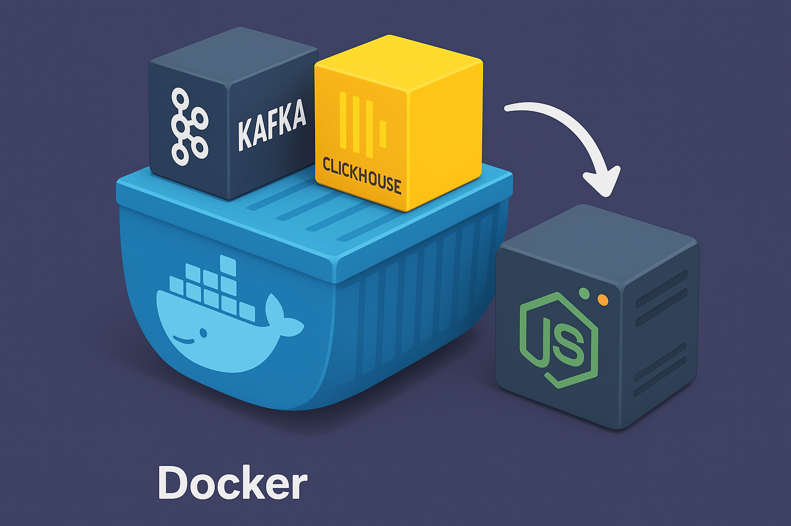

<div align="center">

# 🚀 Kafka ClickHouse Development Setup

### ✨ Complete Local Development Environment for Kafka & ClickHouse ✨

<p align="center">
  
</p>

<div align="center">
  
  [](https://ashishport.vercel.app)
  [](mailto:ashishjadhav9900@gmail.com)
  [](https://github.com/Ashish1022/kafka-clickhouse-pipeline)
  
</div>

---

<!-- Add your hero banner image here -->


</div>

## 🎯 What is This Repository?

<table>
<tr>
<td width="50%">

**Kafka ClickHouse Development Setup** is a complete local development environment that helps you get started with **Apache Kafka** and **ClickHouse** in minutes, not hours.

🐳 **Docker Powered**  
⚡ **Lightning Fast Setup**  
🔄 **Real-time Processing**  
🛠️ **Developer Friendly**

Perfect for developers who want to experiment with real-time data processing and analytics without complex infrastructure setup.

</td>
</tr>
</table>

## 🔥 Why Use This Setup?

<div align="center">

|                                  🏆 **For Developers**                                   |                                      🛠️ **For Learning**                                      |
| :--------------------------------------------------------------------------------------: | :-------------------------------------------------------------------------------------------: |
|            |                  |
|             |  |
|  |           |
|      |          |
|            |          |

</div>

---

## 🐳 Docker Setup Commands

### 🌐 Create Docker Network

```bash
# Create a custom network for communication between containers
docker network create pipeline-network
```

### 🔥 Kafka Setup

```bash
# 1. Pull Apache Kafka image
docker pull apache/kafka

# 2. Run Kafka broker container
docker run -d -p 9092:9092 --network pipeline-network --name broker apache/kafka

# 3. Access Kafka container and create a test topic
docker exec --workdir /opt/kafka/bin/ -it broker sh
./kafka-topics.sh --bootstrap-server localhost:9092 --create --topic test-topic
```

### 🏪 ClickHouse Setup

```bash
# 1. Pull ClickHouse server image
docker pull clickhouse/clickhouse-server

# 2. Run ClickHouse container
docker run -d -p 18123:8123 -p 19000:9000 -e CLICKHOUSE_PASSWORD=changeme --network pipeline-network --name some-clickhouse-server --ulimit nofile=262144:262144 clickhouse/clickhouse-server

# 3. Access ClickHouse container
docker exec -it some-clickhouse-server bash

# 4. Start ClickHouse client
clickhouse-client

# 5. Create table for log events
CREATE TABLE log_events (
    id UUID,
    timestamp DateTime MATERIALIZED now(),
    message String,
    metadata Nullable(String)
) ENGINE=MergeTree
PARTITION BY toYYYYMM(timestamp)
ORDER BY (timestamp);
```

---

## 🏗️ Monorepo Structure

<div align="center">

This monorepo consists of **3 main applications**:

<table>
<tr>
<td width="33%" align="center">

<br><strong>kafka-clickhouse-service</strong>
<br><em>Express app with controllers & helpers</em>
</td>
<td width="33%" align="center">

<br><strong>consumer-frontend</strong>
<br><em>Next app for data consumption</em>
</td>
<td width="33%" align="center">

<br><strong>producer-frontend</strong>
<br><em>Next app for data production</em>
</td>
</tr>
</table>

</div>

### 🎯 **kafka-clickhouse-service**

The heart of the setup! This Express.js application provides:

- 🔗 **Kafka Integration**: Controllers for producer/consumer management
- 🏪 **ClickHouse Connection**: Helpers for database operations
- 🛠️ **RESTful APIs**: Clean endpoints for frontend communication
- 📊 **Data Processing**: Real-time data transformation utilities

---

## 🚀 Local Development Setup

### 📋 Prerequisites

<div align="center">

<p>


</p>

</div>

### 🔧 Installation Steps

```bash
# 1. Clone the repository
git clone https://github.com/Ashish1022/kafka-clickhouse-pipeline.git
cd kafka-clickhouse-pipeline

# 2. Install dependencies for consumer frontend
cd apps/consumer-frontend
pnpm install

# 3. Install dependencies for producer frontend
cd ../producer-frontend
pnpm install

# 4. Install dependencies for backend service
cd ../kafka-clickhouse-service
pnpm install

# 5. Run the entire development setup
cd ../../  # Back to root folder
pnpm dev
```

---

## 🎥 Demo Videos

<div align="center">

### 📡 **Kafka Broker & Consumer Connections**


https://github.com/user-attachments/assets/53d53417-6b7a-42b2-83fc-aa406f097141


<p>

</p>

### 🏪 **ClickHouse Data Visualization**


https://github.com/user-attachments/assets/6c9fa5ee-347b-4edf-b986-20fe0d6aedc1


<p>

</p>

</div>

---

## 🛠️ Tech Stack

<div align="center">

### Core Technologies

<p>


</p>

### Backend & Frontend

<p>


</p>

</div>

---

## 🌟 Features

<div align="center">
<table>
<tr>
<td width="50%">

### 🚀 **Development Features**

```
🐳 Docker Integration
   └── One-command setup
   └── Isolated environments
   └── Cross-platform support

⚡ Real-time Processing
   └── Kafka message streaming
   └── ClickHouse analytics
   └── Live data visualization

🔧 Express Backend
   └── RESTful APIs
   └── Kafka controllers
   └── ClickHouse helpers
```

</td>
<td width="50%">

### 🎯 **Production Ready**

```
📊 Data Analytics
   └── Real-time dashboards
   └── Historical data analysis
   └── Performance monitoring

🔒 Robust Architecture
   └── Error handling
   └── Connection pooling
   └── Health checks

🛠️ Developer Experience
   └── Hot reload
   └── TypeScript support
   └── Clear documentation
```

</td>
</tr>
</table>
</div>

---

## 📈 Performance Metrics

<div align="center">

<table>
<tr>
<td align="center">

<br><strong>Quick Setup</strong>
</td>
<td align="center">

<br><strong>Low Latency</strong>
</td>
<td align="center">

<br><strong>High Throughput</strong>
</td>
<td align="center">

<br><strong>Reliable</strong>
</td>
</tr>
</table>

</div>

---

## 🤝 Contributing

<div align="center">

We ❤️ contributions! Help us make this setup even better.

[](CONTRIBUTING.md)
[](https://github.com/Ashish1022/kafka-clickhouse-pipeline/issues)
[](https://github.com/Ashish1022/kafka-clickhouse-pipeline/pulls)

</div>

---

## 📬 Get In Touch

<div align="center">
<table>
<tr>
<td align="center">
<a href="mailto:ashishjadhav9900@gmail.com">

</a>
</td>
<td align="center">
<a href="https://ashishport.vercel.app">

</a>
</td>
</tr>
</table>
</div>

---

## 📄 License

<div align="center">

[](LICENSE)

</div>

---

<div align="center">

### 🎉 **Ready to Start Building?**

<p>
<a href="#-local-development-setup">

</a>
</p>

### ⭐ **Found This Helpful?**

<p>
<a href="https://github.com/Ashish1022/kafka-clickhouse-pipeline">

</a>
</p>

<p><em>Your star helps other developers discover this project! 🌟</em></p>

<br>

**Built with 💜 by [Ashish Jadhav](https://ashishport.vercel.app)**

### 👨‍💻 About the Developer

<div align="center">
<table>
<tr>
<td align="center">

<br><strong>Ashish Jadhav</strong>
<br><em>Passionate about modern web technologies</em>
</td>
<td align="center">

<br><strong>Community Builder</strong>
<br><em>Helping developers worldwide</em>
</td>
<td align="center">

<br><strong>Innovation Focused</strong>
<br><em>Building the future of web</em>
</td>
</tr>
</table>
</div>

<div align="center">
<table>
<tr>
<td align="center">
<a href="mailto:ashishjadhav9900@gmail.com">

</a>
</td>
<td align="center">
<a href="https://ashishport.vercel.app">

</a>
</td>
<td align="center">
<a href="https://github.com/Ashish1022/kafka-clickhouse-pipeline">

</a>
</td>
</tr>
</table>
</div>

<p>

</p>

---


</div>
